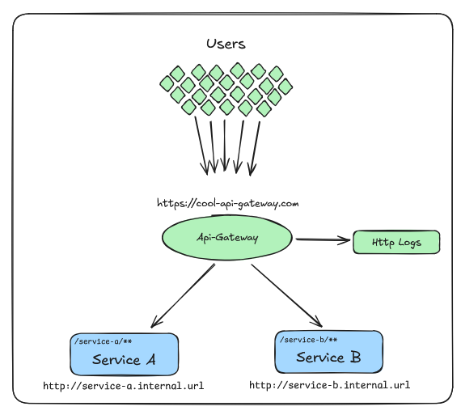
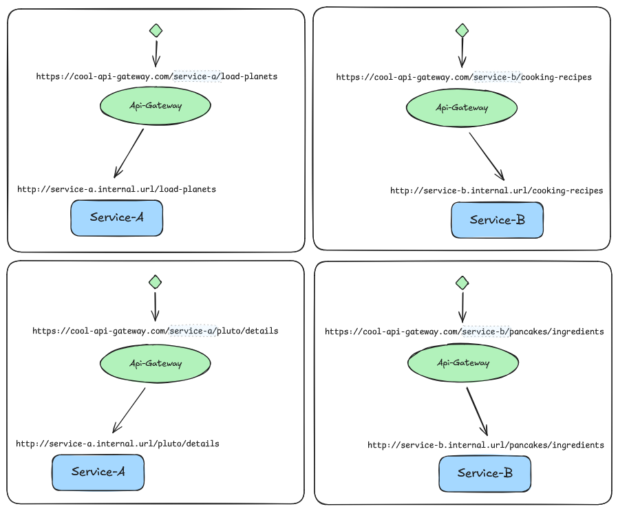

# Api-Gateway

[](#)
[](#)
[](#)
[](#)
[](#)

A ready-to-deploy **API Gateway** built with **Spring Boot**, **PostgreSQL** and **Flutter**.
It centralizes client requests, routes them to internal services, logs traffic, and provides an admin UI for monitoring.

## Table of Contents

- [1 - Overview](#1)
    - [1.1 - How it work](#1.1)
    - [1.2 - Example](#1.2)
- [2 - Quick Start](#2)
- [3 - About this version (5.x)](#3)
- [4 - Configuring the service](#4)
    - [4.1 - Env Variables table](#4.1)
    - [4.2 - PORT, PROFILE & APPLICATION_NAME](#4.2)
    - [4.3 - ADMIN_USERNAME & ADMIN_PASSWORD](#4.3)
    - [4.4 - ADMIN_PATH](#4.4)
    - [4.5 - DB_HOST, DB_PORT, DB_NAME, DB_USERNAME, DB_PASSWORD](#4.5)
    - [4.6 - MAINTAIN_LOGS_FOR_DAYS](#4.6)
- [5 - Api Docs](#5)
    - [5.1 - Login](#5.1)
    - [5.2 - Routes](#5.2)
    - [5.3 - Http Logs](#5.3)
    - [5.4 - Examples](#5.4)
- [6 - Project Versions & Roadmap](#6)
    - [6.1 - Version Overview](#6.1)
    - [6.2 - Notes & Recommendations](#6.2)
    - [6.3 - Extra / Interesting Tips](#6.3)

## **Overview**  <a name="1"></a>

An **API Gateway** acts as a single entry point for all client requests, routing them to the appropriate internal
services. Instead of clients communicating directly with multiple microservices, they only interact with the gateway,
which handles:

* 🔀 **Request routing** → Determines which service should handle the request based on the path.
* 📜 **Centralized logging** → Captures HTTP logs for monitoring and debugging.
* 🔒 **Service abstraction** → Clients don’t need to know the internal URLs of services. Services may not be public on
  the internet.
* 📈 **Scalability** → Easily connect more services.
* 🖥️ **Admin Dashboard** → Visual manage routes and review HTTP logs.

Next, a graphic representation of the gateway:



### **How it works** <a name="1.1"></a>

1. **Users** send requests to a single public endpoint:
   `https://cool-api-gateway.com`
2. The **API Gateway** analyzes the request path and forwards it to the corresponding internal service:

* Requests to `/service-a/**` → routed to **Service A** → `http://service-a.internal.url`
* Requests to `/service-b/**` → routed to **Service B** → `http://service-b.internal.url`

3. Each request and response is recorded in the **HTTP Logs** for auditing and monitoring.
4. Internal services are **isolated** and not directly exposed to the users.

### **Example**  <a name="1.2"></a>

* Request: `https://cool-api-gateway.com/service-a/load-planets` → Gateway forwards
  to: `http://service-a.internal.url/load-planets`
* Request: `https://cool-api-gateway.com/service-a/pluto/details` → Gateway forwards
  to: `http://service-a.internal.url/pluto/details`
* Request: `https://cool-api-gateway.com/service-b/cooking-recipes` → Gateway forwards
  to: `http://service-b.internal.url/cooking-recipes`
* Request: `https://cool-api-gateway.com/service-b/pancake/ingredients` → Gateway forwards
  to: `http://service-b.internal.url/pancake/ingredients`

Here, the visual representation of the example:



---

## **Quick start**  <a name="2"></a>

To run it and start testing it right now, you can:

```bash
# 1. Clone the repo
git clone https://github.com/Root-101/api-gateway.git
cd api-gateway

# 2. Run the services with Docker
docker-compose up --build

# 3. Go to:
#    - Gateway API → http://localhost:8080
#    - PostgreSQL  → localhost:5432
#    - Web UI      → http://localhost
```

> 💡 Tip: If you prefer, you can deploy it on Railway with a single click:

[](https://railway.app/template/IR4lVv?referralCode=6_5_ta)

## About this version (5.x) <a name="3"></a>

This version (5.x) adds a Http Logs system, where each request made through this gateway will be saved as logs for later
review.

We include the updated ui-client, it's a web made with [Flutter](https://flutter.dev/) located
under `/tools/api_gateway_front`, and the [Postman collection](doc/Api-Gateway.postman_collection.json) to test the
management endpoints.

## Configuring the service <a name="4"></a>

To configure the gateway we have a variety of environmental variables at our disposal.
These are configured before the service start.

### Env Variables table <a name="4.1"></a>

| Env Variable           | Expected | Description                               | Default value (and example) | Added in version |
|------------------------|----------|-------------------------------------------|-----------------------------|------------------|
| PORT                   | integer  | Port in which the service will be running | 8080                        | 2.x              |
| PROFILE                | text     | Profile type of the service (Environment) | DEV                         | 2.x              |
| APPLICATION_NAME       | text     | Application name                          | App Api-Gateway             | 2.x              |
| ADMIN_USERNAME         | text     | Username of the admin user                | admin                       | 3.x              |
| ADMIN_PASSWORD         | text     | Password of the admin user                | admin123**                  | 3.x              |
| ADMIN_PATH             | text     | Path of the admin (management) endpoints  | _admin                      | 3.x              |
| DB_HOST                | text     | Host of the running DB                    | localhost                   | 4.x              |
| DB_PORT                | integer  | Port of the running DB                    | 5432                        | 4.x              |
| DB_NAME                | text     | Name of the DB                            | api-gateway                 | 4.x              |
| DB_USERNAME            | text     | Username of the DB user                   | postgres                    | 4.x              |
| DB_PASSWORD            | text     | Password of the DB user                   | a123b456**                  | 4.x              |
| MAINTAIN_LOGS_FOR_DAYS | integer  | Number of days the logs will be available | 14                          | 5.x              |

#### PORT, PROFILE & APPLICATION_NAME <a name="4.2"></a>

These environment variables are general service configurations, they can be left perfectly with the default values
and would not have major impacts.

#### ADMIN_USERNAME & ADMIN_PASSWORD <a name="4.3"></a>

As a security measure, the gateway management endpoints, with which new routes are created, edited, deleted and
listed, and the logs are listed, are protected with a layer of security.

In this case, a `basic` auth type is used, which must be provided with a username and password to access.

By configuring these variables (`ADMIN_USERNAME` and `ADMIN_PASSWORD`), the admin endpoints of the service can be
protected against unauthorized access.

> ⚠️ WARNING: It is recommended that production environments be properly configured to avoid (mainly) security issues.

#### ADMIN_PATH <a name="4.4"></a>

To avoid conflicts between management endpoints and redirects, this environment variable was designed to define the
parent path of said management endpoints.

In general, the URL of a management endpoint would be: `http(s)://ip:port/ADMIN_PATH/....`.

An example running on localhost without setting the variable (using the default value) would
be: `http://localhost:8080/_admin/routes`

Setting this variable to `ADMIN_PATH = gateway-admin` would be: `http://localhost:8080/gateway-admin/routes`

This way, if we have a service that is expected to be redirected to, and we want its URL to be `gateway-admin`, we can
modify said variable so that that path is not occupied and the requests are redirected to the service instead of the
configuration controller.

#### DB_HOST, DB_PORT, DB_NAME, DB_USERNAME, DB_PASSWORD <a name="4.5"></a>

These environment variables are used to configure the connection to the DB, and are then used as follows:

```
  r2dbc:
    url: r2dbc:postgresql://${DB_HOST:localhost}:${DB_PORT:5432}/${DB_NAME:api-gateway}
    username: ${DB_USERNAME:postgres}
    password: ${DB_PASSWORD:admin123}
```

#### MAINTAIN_LOGS_FOR_DAYS <a name="4.6"></a>

In version 5.x, we introduced logs, which allow each request to be recorded.

To avoid excessive resource consumption, a cron job runs every day at midnight to delete old logs. To define when a log
is considered old, this environment variable is provided that allows modifying the number of days logs remain in the
system.

By default it's configure to maintain logs for 14 days.

## **API Docs** <a name="5"></a>

The **API Gateway** exposes several **management endpoints** that allow administrators to:

* 🔐 **Authenticate** — Secure all configuration endpoints with **Basic Auth** credentials.
* 🔀 **Manage dynamic routes** — Create, update, and delete routes that define how requests are forwarded to internal
  services.
* 📜 **Access HTTP logs** — Search, filter, and export all incoming requests for monitoring and debugging purposes.

For ease of use, we include a **web-based admin UI** that interacts with these endpoints behind the scenes.
However, if you prefer, **you can interact with the REST API directly** using tools like **Postman** or **cURL**.

### Login <a name="5.1"></a>

Use this endpoint to validate the administrator credentials before accessing the management features of the API Gateway.
Mainly used since in v4.2.0 we add the ui client, and this endpoint is used to validate credentials in the login page.

| Method | Endpoint               | Description                                 |
|--------|------------------------|---------------------------------------------|
| GET    | /**_admin**/auth/login | Check if the admin user/password is correct |

> ⚠️ WARNING: if the value of env `ADMIN_PATH` changes, the endpoints will change. These tables are based on the default
> value of this variable (`_admin`).
>
> 💡️ TIP: [Here](./doc/detailed-api-docs-README.md#2) we provide the complete details of each endpoint, the
> request/response body, with example and visual reference in the web-base admin UI.

### Routes <a name="5.2"></a>

These endpoints allow administrators to manage dynamic routes in the API Gateway.
Each route defines how incoming requests are redirected to internal services.

| Method | Endpoint                      | Description                                                                     |
|--------|-------------------------------|---------------------------------------------------------------------------------|
| GET    | /**_admin**/routes            | Get all configured routes in the gateway                                        |
| GET    | /**_admin**/routes/{route-id} | Get details of a single route                                                   |
| POST   | /**_admin**/routes            | Create a new route to redirect                                                  |
| POST   | /**_admin**/routes/multi-add  | Create multiple routes in same request                                          |
| PUT    | /**_admin**/routes/{route-id} | Edit the route with id = route-id, replace it with route in body of the request |
| DELETE | /**_admin**/routes/{route-id} | Delete the route with id = route-id                                             |

> ⚠️ WARNING: if the value of env `ADMIN_PATH` changes, the endpoints will change. These tables are based on the default
> value of this variable (`_admin`).
>
> 💡️ TIP: [Here](./doc/detailed-api-docs-README.md#3) we provide the complete details of each endpoint, the
> request/response body, with example and visual reference in the web-base admin UI.

### Http Logs <a name="5.3"></a>

Starting from v5.0.0, the API Gateway includes an HTTP Logs system that allows administrators to search, filter, and
review all incoming requests passing through the gateway.

| Method | Endpoint             | Description                                                  |
|--------|----------------------|--------------------------------------------------------------|
| POST   | /**_admin**/http-log | Get the logs, use POST to send in the body the search params |

> ⚠️ WARNING: if the value of env `ADMIN_PATH` changes, the endpoints will change. These tables are based on the default
> value of this variable (`_admin`).
>
> 💡️ TIP: [Here](./doc/detailed-api-docs-README.md#4) we provide the complete details of each endpoint, the
> request/response body, with example and visual reference in the web-base admin UI.

> **Note:** The API Gateway logs **almost all requests**. Exceptions include:
>
> * **OPTIONS requests** — Considered “preflight” or non-critical, so they are **not logged**.
> * **Requests to the logs search endpoint** — To avoid recursive logging, requests made to fetch logs are **not
    recorded**.
> * **GET requests to the routes endpoints** — Only route creation, update, or deletion requests are logged; simple GETs
    to retrieve route information are **excluded**.
>
> ⚡ **Future improvement:** A configuration option may be added to **customize which requests are logged**.

### **Examples** <a name="5.4"></a>

To test and explore the API Gateway endpoints, we use [**Postman**](https://www.postman.com/downloads/).
A complete **Postman collection** is available, containing **all endpoints** and **example requests**:

📄 **Collection file:** [**HERE**](doc/Api-Gateway.postman_collection.json)

Additionally, a dedicated **Postman environment** has been configured to manage all required variables automatically:

🌍 **Environment file:** [**HERE**](doc/Api-Gateway%20-%20Local.postman_environment.json)

---

#### **Configured Postman Environment Variables**  <a name="5.4.1"></a>

| Postman Env Variable | Description                                | Current value         | Configured by                                                                                     |
|----------------------|--------------------------------------------|-----------------------|---------------------------------------------------------------------------------------------------|
| gateway-url          | Url where the service is currently running | http://localhost:8080 | Hosting, this is the url (public or private) of the service, or localhost if it's running locally |
| gateway-admin-path   | Administration endpoints URL               | _admin                | Env Variable: `ADMIN_PATH`                                                                        |
| gateway-username     | Username of the admin user                 | admin                 | Env Variable: `ADMIN_USERNAME`                                                                    |
| gateway-password     | Password of the admin user                 | admin123**            | Env Variable: `ADMIN_PASSWORD`                                                                    |

> ⚠️ **Important:** The default values above are based on the default environment variables.
> If you change any of these variables in your configuration, you must **update them in your Postman environment**
> accordingly.

## **Project Versions & Roadmap** <a name="6"></a>

This project is organized into **multiple versions**, each introducing new features and improvements.
Every version is published under a **dedicated Git tag**, and each tag includes in the **README** details of its
specific version.

### **Version Overview** <a name="6.1"></a>

| **Version** | **Description**                                                                                                                                        |
|-------------|--------------------------------------------------------------------------------------------------------------------------------------------------------|
| **2.x**     | Basic gateway — routes are configured **via environment variables**. To change a route, you must **update the variable** and **redeploy the service**. |
| **3.x**     | Adds **management endpoints** to configure routes **dynamically**, without redeploying the service.                                                    |
| **4.x**     | Integrates a **PostgreSQL database** to **persist configurations**, allowing the service to reload them automatically after redeployment.              |
| **5.x**     | Introduces an **HTTP Logs system** to **store all incoming requests** in the database for later review and analysis.                                   |
| **x.x**     | Planned: Add a **configuration system** to manage settings like **log retention time**, **CORS policies**, **rate limiting**, and more.                |
| **x.x**     | Planned: Add **metrics & statistics** to track response times, failure rates, and the most frequently requested endpoints.                             |

This table outlines both **released** and **planned** features, serving as a **roadmap** for upcoming iterations.

### **Notes & Recommendations** <a name="6.2"></a>

> **📌 Note 1 — Use the Latest Tag**
>
> Each major version (`2.x`, `3.x`, etc.) may have several **minor releases** (e.g., `2.2.0`, `2.1.0`, `2.0.0`).
> Always prefer the **latest available tag** for improved stability and features.
> **Example:** If using the `2.x` series, choose **`2.2.0`** over earlier versions.

> **📌 Note 2 — Stay Updated**
>
> We **recommend** always using the **latest available version** to benefit from:
>
> * ✅ New features
> * 🛠️ Bug fixes
> * ⚡ Better performance
> * 🔒 Security patches

### **Extra / Interesting Tips**  <a name="6.3"></a>

Here are some useful insights and performance notes about the project:

#### 🏎️ **Reduced Memory Consumption**

| Version | Base Image / Build                                        | RAM Usage           |
|---------|-----------------------------------------------------------|---------------------|
| 4.0.1   | `openjdk:21-jdk-oracle` → `eclipse-temurin:21-jre-alpine` | \~500 MB → \~350 MB |
| 4.2.0   | Native build                                              | \~150 MB            |

> ✅ Migrating to lighter base images and native builds significantly reduces memory usage.

---

#### 💰 **Low Hosting Costs**

* Full stack deployed (**PostgreSQL DB + API Gateway + Client UI**) consumes **200–250 MB**.
* Estimated cost on **Railway:** **\$1.50–\$2.00 USD** per month.

> ⚡ Efficient for small deployments and testing environments.

---

#### 🛠️ **Project Focus & Maintenance**

* This is a **side project**, maintained in our free time.
* Given increasing real-world workloads, we’re **pausing new feature development**.
* Current focus is on **bug fixes, stability, and performance improvements**.

> 🟡 Status: **Maintenance Mode** — stable and polished for production use.