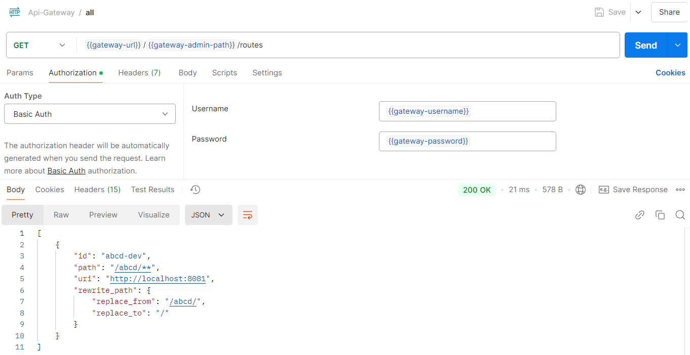
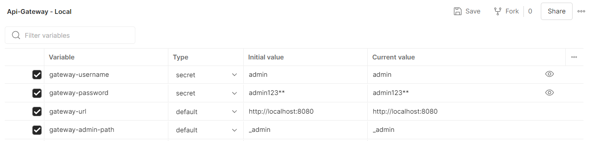

# Api-Gateway

This project is structured in several versions, each version with its own configuration and specific features.
Each version has a tag and in that tag the readme explains these particularities.

In general the tag/features relationship is:

| Version | Description                                                                                                                                  |
|---------|----------------------------------------------------------------------------------------------------------------------------------------------|
| 2.x     | Simple gateway, routes are configured via env variable, to change a route the env variable needs to change and the project redeployed.       |
| 3.x     | Simple gateway, BUT, routes are configured via management endpoint, this allow to change routes without redeploying the service.             |
| 4.x     | Gateway with a Postgresql DB, this way we can storage the config in order to reload it if the service need to be redeployed.                 |
| 5.x     | We will add a log filter that storage all requests made to the gateway into DB in order to review all traffic that goes through the service. |
| 6.x     | We will add a monitoring capability to see the availability of the services (the same of the routes of the gateway or any other).            |

NOTE #1: All this version and explanation are some kind of roadmap of what we pretend to ship in next's iterations.

NOTE #2: All features will have its rest api for communication & configuration, BUT, we pretend to develop a UI client
to make the job easier.

NOTE #3: Try to always use the latest version available for each tag. (Eg: The 2.x tag has versions 2.2.0, 2.1.0, 2.0.0;
try to use the latest tag, in this case 2.2.0)

NOTE #4: We recommend that you always use the latest available version, this way you can enjoy all the features, a more
polished project and an overall better experience.

## This is the docs for version 4.x:

---
**title:** Api-Gateway </br>
**description:** A basic ready-to-deploy api gateway </br>
**tags:** </br>

- api-gateway
- spring boot
- java

---

#### About v4.x:

This version adds a postgres DB so that the route configuration can be saved and can be loaded if the service is
restarted.

This version include the api docs and a postman collection with preconfigured endpoints.

### Env Variables to configure the service:

To configure the project we have a variety of environmental variables at our disposal. These are:

| Env Variable     | Description                               | Expected | Default value (and example) | Added in version |
|------------------|-------------------------------------------|----------|-----------------------------|------------------|
| PORT             | Port in which the service will be running | number   | 8080                        | 2.x              |
| PROFILE          | Profile type of the service (Environment) | text     | DEV                         | 2.x              |
| APPLICATION_NAME | Application name                          | text     | App Api-Gateway             | 2.x              |
| ADMIN_USERNAME   | Username of the admin user                | text     | admin                       | 3.x              |
| ADMIN_PASSWORD   | Password of the admin user                | text     | admin123**                  | 3.x              |
| ADMIN_PATH       | Path of the admin (management) endpoints  | text     | _admin                      | 3.x              |
| DB_HOST          | Host of the running DB                    | text     | localhost                   | 4.x              |
| DB_PORT          | Port of the running DB                    | integer  | 5432                        | 4.x              |
| DB_NAME          | Name of the DB                            | text     | api-gateway                 | 4.x              |
| DB_USERNAME      | Username of the DB user                   | text     | postgres                    | 4.x              |
| DB_PASSWORD      | Password of the DB user                   | text     | postgres_password           | 4.x              |

##### PORT, PROFILE & APPLICATION_NAME:

These environment variables are general service configurations, they can be left perfectly with the default values
and would not have major impacts.

##### ADMIN_USERNAME & ADMIN_PASSWORD:

As a security measure, the gateway management endpoints, with which new routes are created, edited, deleted and
listed, are protected with a layer of security.

In this case, a `basic` auth type is used, which must be provided with a username and password to access.

By configuring these variables (`ADMIN_USERNAME` and `ADMIN_PASSWORD`) the admin endpoints of the service can be
protected against unauthorized access.

**It is recommended that production environments be properly configured to avoid (mainly) security issues.**

##### ADMIN_PATH:

To avoid conflicts between management endpoints and redirects, this environment variable was designed to define the
parent path of said management endpoints.

In general, the URL of a management endpoint would be: `http(s)://ip:port/ADMIN_PATH/....`.

An example running on localhost without setting the variable (using the default value) would
be: `http://localhost:8080/_admin/routes`

Setting this variable to `ADMIN_PATH = gateway-admin` would be: `http://localhost:8080/gateway-admin/routes`

This way, if we have a service that is expected to be redirected to, and we want its URL to be `gateway-admin`, we can
modify said variable so that that path is not occupied and the requests are redirected to the service instead of the
configuration controller.

##### DB_HOST, DB_PORT, DB_NAME, DB_USERNAME, DB_PASSWORD:

These environment variables are used to configure the connection to the DB, and are then used as follows:

```
  r2dbc:
    url: r2dbc:postgresql://${DB_HOST:localhost}:${DB_PORT:5432}/${DB_NAME:api-gateway}
    username: ${DB_USERNAME:postgres}
    password: ${DB_PASSWORD:admin123}
```

Variables must be available at compile time (since we started using the native image in v4.1.0), so they are set by
default and then overridden with the real values.

### Api docs:

The administration API gives us access to endpoint to configure the routes, here we have:

| Method | Endpoint                  | Description                                                                     | Body                |
|--------|---------------------------|---------------------------------------------------------------------------------|---------------------|
| GET    | /_admin/routes            | Get all configured routes in the gateway                                        | No body             |
| GET    | /_admin/routes/{route-id} | Get details of a single route                                                   | No body             |
| POST   | /_admin/routes            | Create a new route to redirect                                                  | Route model         |
| POST   | /_admin/routes/multi-add  | Create multiple routes in same request                                          | List of Route model |
| PUT    | /_admin/routes/{route-id} | Edit the route with id = route-id, replace it with route in body of the request | Route model         |
| DELETE | /_admin/routes/{route-id} | Delete the route with id = route-id                                             | No body             |

NOTE: if the value of env `ADMIN_PATH` changes, the endpoint will change. This table is based on the default value of
this variable (_admin).

#### Route model:

This is the full json of a route model.

```json
{
  "name": "test-dev",
  "path": "/test-service/**",
  "uri": "http://localhost:8081",
  "description": "A test route",
  "rewrite_path": {
    "replace_from": "/test-service/",
    "replace_to": "/"
  }
}
```

Here we have:

| Field        | Required | Description                                                                                                | Validations                        | Recommendations                                                                                                                                                                                                                                                             |
|--------------|----------|------------------------------------------------------------------------------------------------------------|------------------------------------|-----------------------------------------------------------------------------------------------------------------------------------------------------------------------------------------------------------------------------------------------------------------------------|
| name         | true     | Name with which this route will be identified (human like name). It's an unique identifier for each route. | - Not null<br/>-Not Empty          | Use a unique, easy to identify value                                                                                                                                                                                                                                        |
| path         | true     | Route with which the redirection to a specific service will be identified                                  | - Not null<br/>-Not Empty          | Use in the format /{path}/**, this means that all requests made to https://gateway/{path}/..... will be redirected to this route                                                                                                                                            |
| uri          | true     | Url of the service to which you are going to redirect                                                      | - Not null<br/>-Not Empty<br/>-Url | Use same base url of the service (preferably a private URL without internet access, which can only be accessed through the gateway)                                                                                                                                         |
| description  | false    | Additional description of the route                                                                        |                                    | Use it for some basic descriptive description of the route                                                                                                                                                                                                                  |
| rewrite_path | false    | 'Filter' to rewrite the final path to which the request is made (replace in final url the *from* => *to*)  | - Not null<br/>-Not Empty<br/>     | Use to fix the extra path added by path property. With example, a request made to:  https://gateway/abcd/users/search, by default will be redirected to: http://localhost:8081/abcd/users/search, but with rewrite will be redirected to http://localhost:8081/users/search |

### Admin endpoint examples:

To test the endpoints manually, the [`Postman`](https://www.postman.com/downloads/) tool was used,
so below are all the examples and collections needed using this tool.

The entire collections with all the admin endpoint could be found [**HERE**](doc/Api-Gateway.postman_collection.json).

This is how an administration endpoint would be consumed:



Note that there are several environment variables configured in Postman, these variables can be found in:



Which can be directly imported
from [**THIS FILE**](doc/Api-Gateway%20-%20Local.postman_environment.json).

These are:

| Postman Env Variable | Description                                | Current value         | Configured by                                                                                     |
|----------------------|--------------------------------------------|-----------------------|---------------------------------------------------------------------------------------------------|
| gateway-url          | Url where the service is currently running | http://localhost:8080 | Hosting, this is the url (public or private) of the service, or localhost if it's running locally |
| gateway-admin-path   | Administration endpoints URL               | _admin                | Env Variable: `ADMIN_PATH`                                                                        |
| gateway-username     | Username of the admin user                 | admin                 | Env Variable: `ADMIN_USERNAME`                                                                    |
| gateway-password     | Password of the admin user                 | admin123**            | Env Variable: `ADMIN_PASSWORD`                                                                    |

Note that these values are set to the default values of each environment variable, in case one of these environment
variables changes, its value must be modified in Postman.

##### Redirection Examples:

Let's assume we start the server and call the endpoint of multi-add to configure the initial routes, this is the
configuration we use:

```json
[
  {
    "id": "notifications-dev",
    "path": "/notification/**",
    "uri": "https://push-notification.com",
    "rewrite_path": {
      "replace_from": "/notification/",
      "replace_to": "/"
    }
  },
  {
    "id": "test-dev",
    "path": "/test/**",
    "uri": "https://url-of-test-service.com",
    "rewrite_path": {
      "replace_from": "/test/",
      "replace_to": "/"
    }
  },
  {
    "id": "versioning",
    "path": "/ver/**",
    "uri": "https://otherrandomservice.com"
  }
]
```

With this configuration we will note that a:

| Request to                                                  | Is redirected to                                     |
|-------------------------------------------------------------|------------------------------------------------------|
| https://api-gateway.com/notification/send-push-notification | https://push-notification.com/send-push-notification |
| https://api-gateway.com/notification/{user-id}/send-push    | https://push-notification.com/{user-id}/send-push    |
| https://api-gateway.com/test/some-test-endpoint             | https://url-of-test-service.com/some-test-endpoint   |
| https://api-gateway.com/test/{user-id}/hi-world             | https://url-of-test-service.com/{user-id}/hi-world   |
| https://api-gateway.com/ver/magic-endpoint                  | https://otherrandomservice.com/ver/magic-endpoint    |

#### Extra docs:

- Client to consume the administration API: [Postman](https://www.postman.com/downloads/)
- Postman collection with administration endpoints
  preconfigured (to import in postman): [Api-Gateway.postman_collection.json](doc/Api-Gateway.postman_collection.json)
- Service default environment variables (to import in
  postman): [Api-Gateway - Local.postman_environment.json](doc/Api-Gateway%20-%20Local.postman_environment.json)

This it's all for now,

this is after all, a project designed for deploy in railway as a template... so:

[](https://railway.app/template/IR4lVv?referralCode=6_5_ta)
