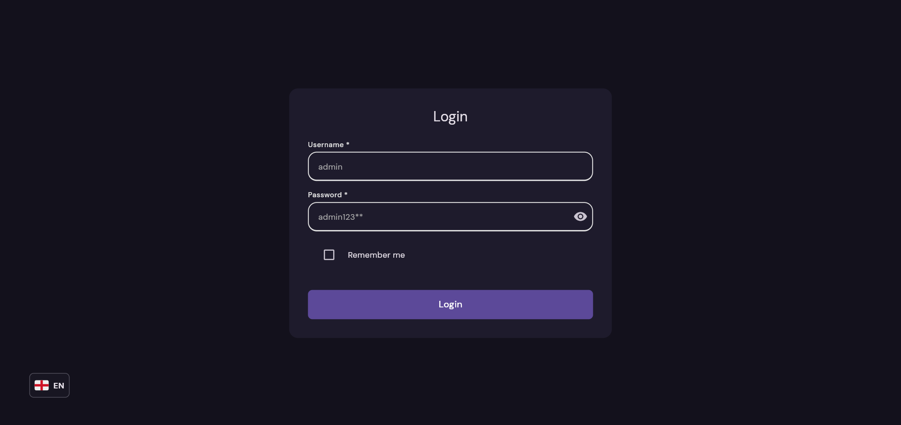
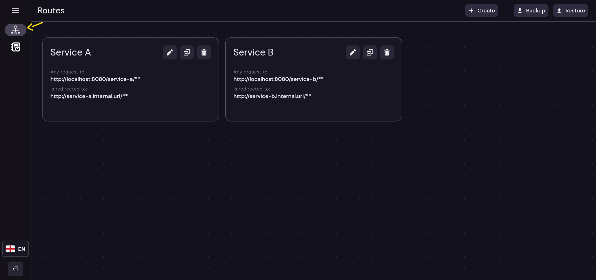
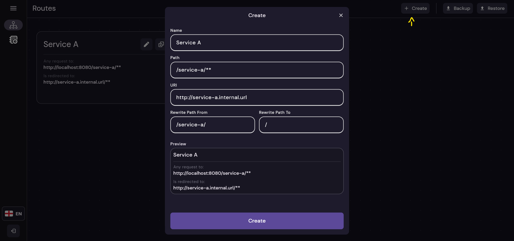
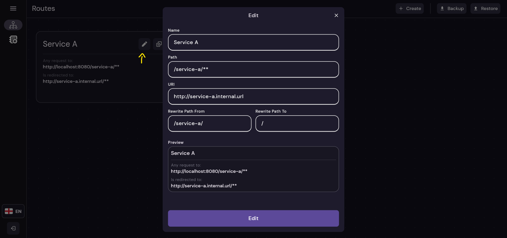
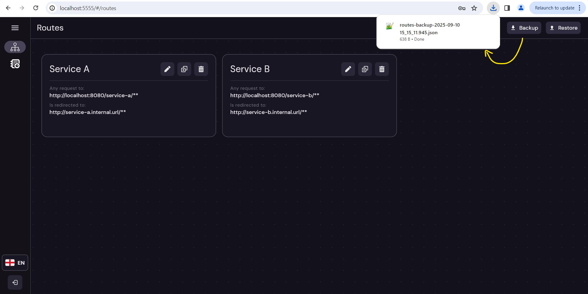
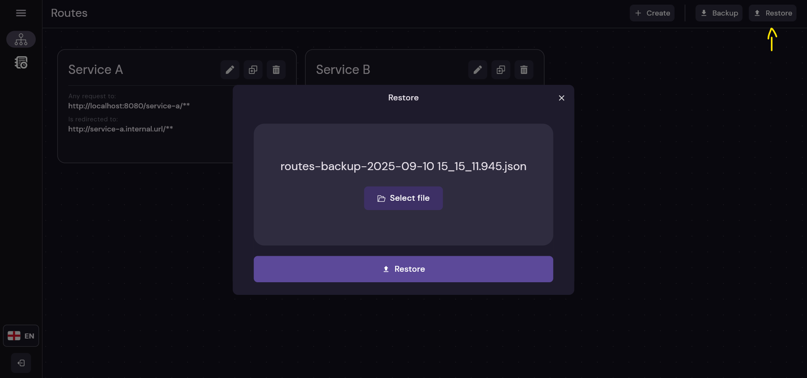

# Detailed API Docs

A fine grain explanation of **every endpoint**, with **example**, **models**, **screenshots** of Web UI... everything.

## Table of Contents

- [1 - Overview](#1)
- [2 - Login](#2)
    - [2.1 - Remember me](#3.2)
- [3 - Routes](#3)
    - [3.1 - View Routes](#3.1)
    - [3.2 - Create Route](#3.2)
    - [3.3 - Edit Route](#3.3)
    - [3.4 - Delete Route](#3.4)
    - [3.5 - Route Details](#3.5)
    - [3.6 - Multi Create](#3.6)
    - [3.7 - Backup Routes](#3.7)
    - [3.8 - Restore Routes](#3.8)
- [4 - Http Logs](#4)

## **Overview**<a name="1"></a>

Overview of this project

## Login<a name="2"></a>

This endpoint validates the **username/password** of an admin user.

#### Login Screen

Screen that interact with endpoint:



#### Endpoint Details

* **HTTP Method:** `POST`
* **Path:** `/_admin/auth/login`

#### Request Body<a name="2.3"></a>

```json
{
  "username": "admin",
  "password": "admin123"
}
```

| Field    | Required | Description                                          | Validations               | Recommendations                                   |
|----------|----------|------------------------------------------------------|---------------------------|---------------------------------------------------|
| username | true     | Username of the admin user. Default to `admin`.      | - Not null<br/>-Not Empty | It's the one configured in env: `ADMIN_USERNAME`  |
| password | true     | Password of the admin user. Default to `admin123**`. | - Not null<br/>-Not Empty | It's the one configured in env: `ADMIN_PASSWORD`. |

#### Response

* **Body:** Empty
* **Success:** `200 OK` → Username/password are correct
* **Error Responses:**
    * `422 Unprocessable Entity` → Validation error

---

### Remember me

When the `Remember me` option is enabled during login, the session will persist even after closing the browser.

This is achieved by storing a long-lived authentication credentials in the web secure storage, so users don't need to
log in again every time they revisit the admin panel.

---

> 🔐 **Authentication Required**  
> From now on, all endpoints require a valid `Authorization` header:
>
> ```
> Authorization: Basic Username:Password
> ```
>
>
> Without it, the API will return:
> - `401 Unauthorized` → Authorization not provided
> - `403 Forbidden` → Wrong provided auth

## Routes<a name="3"></a>

These endpoints allow administrators to **create, view, edit, delete, and manage** dynamic routes within the **API
Gateway**.
Each route defines **how incoming client requests are mapped** and **redirected** to the appropriate **internal services
**.

With these endpoints, you can:

* List all existing routes in the gateway.
* Retrieve detailed information about a specific route.
* Create new routes individually or in bulk.
* Update or delete existing routes.
* Backup and restore route configurations.

> 💡 **Tip:** Routes are essential for service discovery and traffic redirection, ensuring that each incoming request
> reaches the correct backend service.

### View Routes<a name="3.1"></a>

This endpoint and its corresponding UI screen allow administrators to **view all the configured routes** in the **API
Gateway**.
It provides an overview of how incoming requests are currently being redirected to internal services.

**Key features:**

* Lists all available routes in a structured format.
* Displays essential details like name, path, target URI, and rewrite rules.
* Serves as the base for features like **edit**, **delete**, **backup**, **restore**.

Screen example:



#### Endpoint Details

* **HTTP Method:** `GET`
* **Path:** `/_admin/routes`
* **Body:** Empty

#### Response

* **Success:** `200 OK` → Object with the routes data (details below)

#### Response Body

```json
[
  {
    "id": "1b2266de-5178-4089-a7ee-f0c500aa1537",
    "name": "Service A",
    "path": "/service-a/**",
    "uri": "http://service-a.internal.url",
    "rewrite_path": {
      "replace_from": "/service-a/",
      "replace_to": "/"
    },
    "description": "",
    "created_at": "2025-08-22T14:44:53.902031-06:00"
  }
]
```

| Field        | Type          | Description                                                                                                               |
|--------------|---------------|---------------------------------------------------------------------------------------------------------------------------|
| id           | Text. UUID v4 | Unique identifier of the route.                                                                                           |
| name         | Text          | Name with which this route will be identified (human like name). It's an unique identifier for each route.                |
| path         | Text          | Route with which the redirection to a specific service will be identified                                                 |
| uri          | Text          | URL of the service to which you are going to redirect                                                                     |
| description  | Text          | Additional description of the route                                                                                       |
| create_at    | Timestamp     | Date when the route was created                                                                                           |
| rewrite_path | Custom Object | 'Filter' to rewrite the final path to which the request is made (replace in final URL the *replace_from* => *replace_to*) |

---

### Create Route<a name="3.2"></a>

This endpoint and its corresponding UI screen allow administrators to **create a new route** in the API Gateway.

In the **top-right corner** of the routes view, there's a `+ Create` button.
Clicking it opens the following creation dialog:



#### Endpoint Details

* **HTTP Method:** `POST`
* **Path:** `/_admin/routes`

#### Request Body

```json
{
  "name": "Service A",
  "path": "/service-a/**",
  "uri": "http://service-a.internal.url",
  "description": "Service A as an example of configuring a route",
  "rewrite_path": {
    "replace_from": "/service-a/",
    "replace_to": "/"
  }
}
```

| Field        | Required | Description                                                                                                               | Validations                        | Recommendations                                                                                                                                                                                                                                                                                    |
|--------------|----------|---------------------------------------------------------------------------------------------------------------------------|------------------------------------|----------------------------------------------------------------------------------------------------------------------------------------------------------------------------------------------------------------------------------------------------------------------------------------------------|
| name         | true     | Name with which this route will be identified (human like name). It's an unique identifier for each route.                | - Not null<br/>-Not Empty          | Use a unique, easy to identify value                                                                                                                                                                                                                                                               |
| path         | true     | Route with which the redirection to a specific service will be identified                                                 | - Not null<br/>-Not Empty          | Use in the format /{path}/**, this means that all requests made to https://gateway/{path}/..... will be redirected to this route                                                                                                                                                                   |
| uri          | true     | URL of the service to which you are going to redirect                                                                     | - Not null<br/>-Not Empty<br/>-URL | Use same base URL of the service (preferably a private URL without internet access, which can only be accessed through the gateway)                                                                                                                                                                |
| description  | false    | Additional description of the route                                                                                       |                                    | Use it for some basic descriptive description of the route                                                                                                                                                                                                                                         |
| rewrite_path | false    | 'Filter' to rewrite the final path to which the request is made (replace in final URL the *replace_from* => *replace_to*) | - Not null<br/>-Not Empty<br/>     | Use to fix the extra path added by path property. With example, a request made to:  https://gateway/abcd/users/search, by default will be redirected to: http://localhost:8081/abcd/users/search, but with rewrite (like  `/abcd/` → `/`) will be redirected to http://localhost:8081/users/search |

#### Response

* **Body:** Empty
* **Success:** `200 OK` → Route created successfully
* **Error Responses:**
    * `422 Unprocessable Entity` → Validation error

---

### Edit Route<a name="3.3"></a>

This endpoint and its corresponding UI screen allow administrators to **edit an existing route** in the API Gateway.

In the **top-right corner** of a `route’s tile`, click the `✏️` (Edit) button to open the edit dialog:



#### Endpoint Details

* **HTTP Method:** `PUT`
* **Path:** `/_admin/routes/{route-id}`

#### Request Body

Same body as the create route endpoint, full description [HERE](#3.2).

#### Response

* **Body:** Empty
* **Success:** `200 OK` → Route edited successfully
* **Error Responses:**
    * `422 Unprocessable Entity` → Validation error

--- 

### Delete Route<a name="3.4"></a>

This endpoint and its corresponding UI screen allow administrators to **delete an existing route** from the API Gateway.

In the **top-right corner** of a `route’s tile`, click the `🗑️` (Delete) button to immediately remove the route:


> ⚠️ **Warning:** Be careful not to delete a route by accident.

#### Endpoint Details

* **HTTP Method:** `DELETE`
* **Path:** `/_admin/routes/{route-id}`
* **Request Body:** Empty

#### Response

* **Body:** Empty
* **Success:** `200 OK` → Route deleted successfully

---

### Route Details<a name="3.5"></a>

This endpoint allows administrators to **retrieve detailed information about a specific route** in the API Gateway.

While routes are generally loaded via the **View Routes** endpoint, this endpoint is provided for cases where **you need
the details of a single route**.

> ⚠️ **Note:** This endpoint is **not used in the UI**.

#### Endpoint Details

* **HTTP Method:** `GET`
* **Path:** `/_admin/routes/{route-id}`
* **Request Body:** Empty

#### Response

* **Success:** `200 OK` → The route object
* **Error Responses:**
    * `404 Not Found` → Route does not exist

#### Response Body

```json
{
  "route_id": "1b2266de-5178-4089-a7ee-f0c500aa1537",
  "name": "Service A",
  "path": "/service-a/**",
  "uri": "http://service-a.internal.url",
  "rewrite_path_from": "/service-a/",
  "rewrite_path_to": "/",
  "description": "",
  "created_at": "2025-08-22T14:44:53.902031-06:00"
}
```

Same body as the get all routes endpoint, full description [HERE](#3.1).

---

### Multi Create<a name="3.6"></a>

This endpoint allows administrators to **create multiple routes in a single request**, streamlining the configuration of
the API Gateway when adding several routes at once.

#### Endpoint Details

* **HTTP Method:** `POST`
* **Path:** `/_admin/routes/multi-add`

#### Request Body

```json
[
  {
    "name": "Service A",
    "path": "/service-a/**",
    "uri": "http://service-a.internal.url",
    "description": "Service A as an example of configuring a route",
    "rewrite_path": {
      "replace_from": "/service-a/",
      "replace_to": "/"
    }
  },
  {
    "name": "Service B",
    "path": "/service-b/**",
    "uri": "http://service-b.internal.url",
    "description": "Service B as an example of configuring a route",
    "rewrite_path": {
      "replace_from": "/service-b/",
      "replace_to": "/"
    }
  }
]
```

Same body (as a list) as int the create route endpoint, full description [HERE](#3.2.2).

#### Response

* **Success:** `200 OK` → Routes created successfully
* **Response Body:** Empty

### Backup Routes<a name="3.7"></a>

This feature **does not have a dedicated endpoint** since it reuses the data retrieved from [**View Routes**](#3.1).

In the **top-right corner** of the routes view, there is a `⬇️ Backup` button.
Clicking it **converts the currently loaded routes** (from [**View Routes**](#3.1)) and **downloads them as a JSON file
**:



---

### Restore Routes<a name="3.8"></a>

This feature **does not have a dedicated endpoint** since it reuses the [**Multi Create**](#3.6) functionality.

In the **top-right corner** of the routes view, click the `⬆️ Restore` button to open a dialog where you can **drop or
select a JSON file** to restore the routes.

> ⚠️ **Note:** The uploaded file must follow the same format as the [**Multi Create**](#3.6) request body, which is also
> the same format as the response from [**View Routes**](#3.1).



---

## Http Logs<a name="4"></a>

<!--

```json
{
  "page": 0,
  "size": 20,
  "query": "",
  "from_date": "2025-08-01T00:00:00Z",
  "to_date": "2025-08-30T23:59:59Z",
  "response_code": 200,
  "method": "POST",
  "route_id": "00000000-0000-0000-0000-000000000000"
}
```

Here we have:

| Field         | Required | Description                                                              | Validations                            | Recommendations                                                                                                      |
|---------------|----------|--------------------------------------------------------------------------|----------------------------------------|----------------------------------------------------------------------------------------------------------------------|
| page          | true     | Page to search (to allow paginating the logs).                           | - Not null<br/>-Positive or cero (>=0) |                                                                                                                      |
| size          | false    | Size of the page to load.                                                | - Positive (>0)                        | A null value will load all the logs in DB. Used in the export of UI client                                           |
| query         | false    | Used to filter results, matched against: `user_agent`, `path`, `route`.  |                                        |                                                                                                                      |
| from_date     | false    | Used to filter results, loads logs with `requested_date` >= `from_date`. |                                        |                                                                                                                      |
| to_date       | false    | Used to filter results, loads logs with `requested_date` <= `to_date`.   |                                        |                                                                                                                      |
| response_code | false    | Used to filter results, loads logs with this exact `response_code`.      |                                        |                                                                                                                      |
| method        | false    | Used to filter results, loads logs with this exact `http_method`.        |                                        |                                                                                                                      |
| route_id      | false    | Used to filter results by `route`.                                       |                                        | Use `00000000-0000-0000-0000-000000000000` to filter by the admin route, and `NO-ROUTE` to filter logs with no route |

##### Http Log model:

This is the full json of the search and http log model.

```json
{
  "page": 0,
  "size": 20,
  "total_pages": 1,
  "total_elements": 1,
  "page_content": [
    {
      "id": "0d4e3312-c08f-452d-be8d-b351f7e2be4f",
      "source_ip": "0:0:0:0:0:0:0:1",
      "requested_at": "2025-08-25T11:00:00.612396-08:00",
      "user_agent": "PostmanRuntime/7.45.0",
      "http_method": "POST",
      "path": "/_admin/auth/login",
      "response_code": 200,
      "request_duration": 2,
      "route": {
        "route_id": "00000000-0000-0000-0000-000000000000",
        "route_name": "Admin",
        "route_path": "http://localhost:8080/_admin/auth/login"
      }
    }
  ]
}
```

Here we have a wrapper with the page info:

| Field          | Description                                |
|----------------|--------------------------------------------|
| page           | The current page searched                  |
| size           | The size of the searched page              |
| total_pages    | The total amount of pages with this config |
| total_elements | The total amount of logs in DB             |
| page_content   | The real list of http logs model           |

The Http Log Model in the `page_content`:

| Field            | Description                                                                                                                                                            |
|------------------|------------------------------------------------------------------------------------------------------------------------------------------------------------------------|
| id               | Unique UUID that identifies the log entry.                                                                                                                             |
| source_ip        | IP address from which the request was made.                                                                                                                            |
| requested_at     | Exact date and time when the request was made.                                                                                                                         |
| user_agent       | String identifying the client, browser, or tool that made the request.                                                                                                 |
| http_method      | HTTP method used for the request (e.g., GET, POST, PUT, DELETE).                                                                                                       |
| path             | The requested HTTP path or endpoint.                                                                                                                                   |
| response_code    | HTTP status code returned by the server (e.g., 200, 404, 500).                                                                                                         |
| request_duration | Time taken by the server to process the request, expressed in milliseconds.                                                                                            |
| route            | Object containing information about the associated route. It will be **null** if no route was resolved in this request (neither a configured route nor an admin route) |

And the Route in the `route` object:

| Field      | Description                                                                                                                                                    |
|------------|----------------------------------------------------------------------------------------------------------------------------------------------------------------|
| route_id   | Unique UUID of the associated route. This is generated in the create route endpoint. It will be `00000000-0000-0000-0000-000000000000` in case the admin route |
| route_name | Name of the associated route.                                                                                                                                  |
| route_path | Full URL or base path of the associated route.                                                                                                                 |
