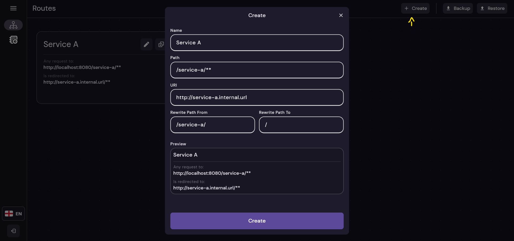
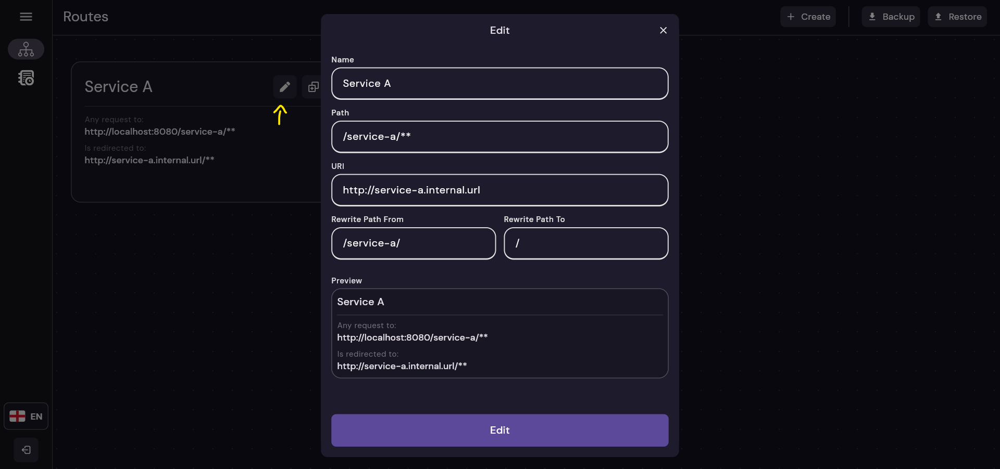
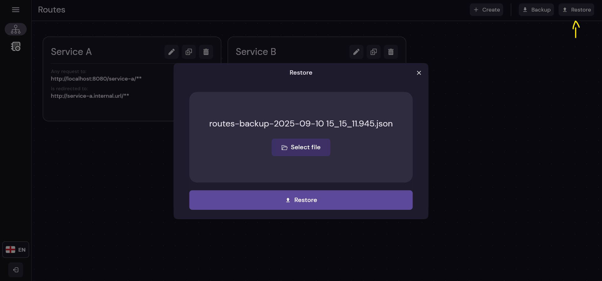
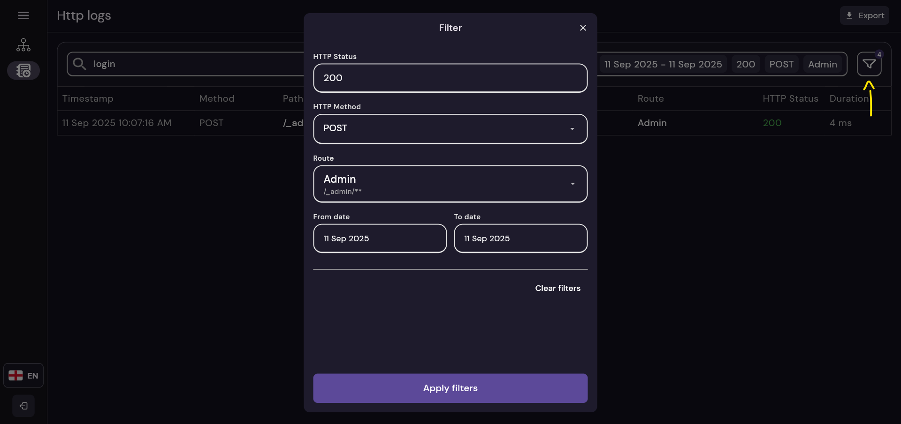

# API-Gateway Front

This project is the **Web UI client** for the **API Gateway**, providing an **easy-to-use interface** to manage routes,
view HTTP logs, and handle administrative tasks.

It is designed to **sync with the latest version** of the API Gateway and provides a visual complement to the REST API.

## Table of Contents

- [1 - Overview](#1)
- [2 - Configuration](#2)
- [3 - Flutter](#3)
- [4 - Screenshots](#4)

---

## Overview

This is the **next iteration** of the integration with the API Gateway.

It allows administrators to:

* 🔀 **Manage routes** — Create, edit, delete, backup, and restore routes.
* 📜 **View HTTP logs** — Filter, search, and inspect requests passing through the gateway.
* 🔐 **Authenticate safely** — Login using the same credentials as the gateway admin endpoints.

> ⚡ **Note:** This version is tied to the corresponding v5.x API Gateway endpoints. Future UI versions will update
> automatically to remain compatible with the latest gateway releases.

---

## Configuration — Environment Variables

The client can be customized using the following **environment variables**:

| Env Variable        | Description                                                                    | Expected | Default value (example)                              | Added in version |
|---------------------|--------------------------------------------------------------------------------|----------|------------------------------------------------------|------------------|
| GATEWAY_SERVICE_URL | Base URL of the API Gateway service                                            | text     | [https://gateway-url.test](https://gateway-url.test) | 1.0.0            |
| ADMIN_PATH          | Admin path of the gateway service (must match `ADMIN_PATH` in the API Gateway) | text     | \_admin                                              | 1.0.0            |

> ⚡ **Tip:** Ensure that the `ADMIN_PATH` matches the API Gateway configuration to allow proper authentication and
> routing of admin requests.

---

## Flutter

This project is developed using **Flutter**, currently version `3.35.1` (as of 05/06/2025).

> 💡 **Note:** Flutter was chosen for rapid development and cross-platform compatibility.
> As a single developer project, it allows quick updates while maintaining a clean and responsive admin interface.

## Screenshots

#### Login screen

#### Routes screen

#### Create route dialog

#### Edit route dialog

#### Delete route

#### Backup routes

#### Restore routes

#### Logs Screen

#### Logs Filter Dialog

#### Change Language

#### Logout

